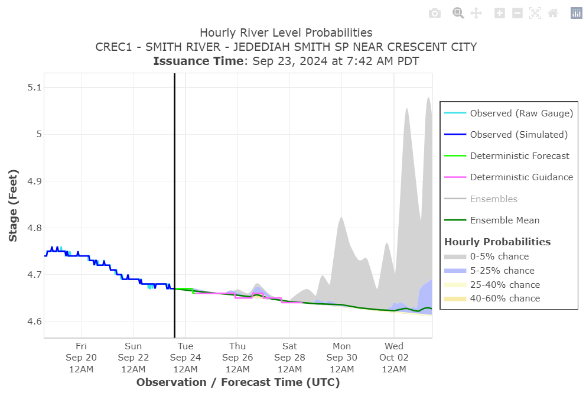

# TethysDash CNRFC Plugin

This repository contains custom [intake](https://intake.readthedocs.io/en/latest/making-plugins.html) drivers that are used in the [tethys dashboard app](https://git.aquaveo.com/tethys/firo/tethysdash) for creating custom visualizations.

Refer to [this documentation](https://git.aquaveo.com/tethys/firo/tethysdash/-/blob/plugins/README.md?ref_type=heads#visualization-plugins) for more information on how to develop new dashboard plugins.

# Available Visualizations

## Impact Statements

Type: table

Description: Provides information from the [NWPS API](https://api.water.noaa.gov/nwps/v1/docs/) for gauge impact statements

## 10-Day Streamflow Volume Accumulation

Type: image

Description: Depicts the 10 day ensemble based streamflow volume accumulation

Source: https://www.cnrfc.noaa.gov/images/ensembles/CREC1.ens_accum10day.png

## 10-Day Hourly Maximum Streamflow Probability

Type: image

Description: Depicts the 10 day ensemble based hourly maximum streamflow probability

Source: https://www.cnrfc.noaa.gov/images/ensembles/CREC1.ens_boxwhisker.png

## 10-Day Daily Maximum Streamflow Probability

Type: image

Description: Depicts the 10 day ensemble based daily maximum streamflow probability

Source: https://www.cnrfc.noaa.gov/images/ensembles/CREC1.ens_10day.png

## Monthly Streamflow Volume Exceedance

Type: image

Description: Depicts the monthly ensemble based streamflow volume exceedance probabilities

Source: https://www.cnrfc.noaa.gov/images/ensembles/ARCC1.ens_monthly.png

## 5 Day Streamflow Volume Exceedance

Type: image

Description: Depicts the 5 day ensemble based streamflow volume exceedance probabilities

Source: https://www.cnrfc.noaa.gov/images/ensembles/CREC1.ens_4x5day.png

## Daily Briefing

Type: image

Description: Depicts the CNRFC daily briefing

Source: https://www.cnrfc.noaa.gov/images/dailyBriefing/dailyBriefing.png

## HEFS

Type: plotly

Description: Depicts the observed, deterministic, and ensembled based statistical streamflow forecasts

